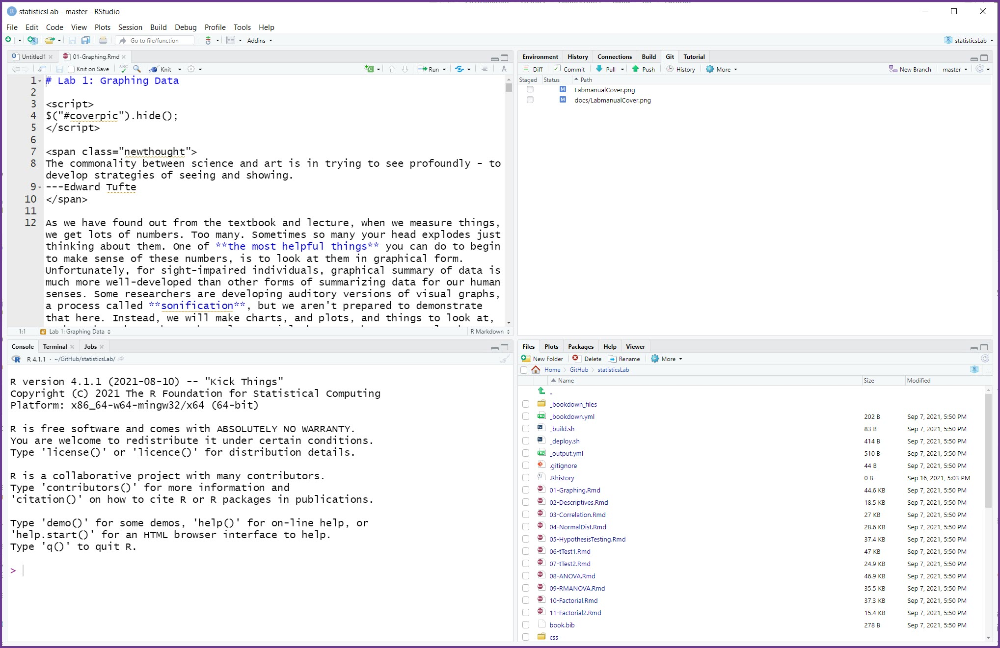

--- 
title: "Business Data Literacy: Lab Manual"
author: "Dawn Wright"
date: "9/30/2021"
site: bookdown::bookdown_site
output: 
  bookdown::gitbook:
    includes:
      in_header: includeme.html
      before_body: testpic.html
    css: [tufte.css, style.css]
    fontsettings:
      theme: white
      family: sans
      size: 1
documentclass: book
bibliography: [book.bib, packages.bib, MyLibrary.bib]
biblio-style: apalike
link-citations: yes
#github-repo: rstudio/bookdown-demo
description: "A lab manual for Business Data Literacy"
---

```{r setup, include=FALSE}
knitr::opts_chunk$set(message=FALSE,warning=FALSE, cache=TRUE)
```


# Preface {-}

```{r,eval=FALSE,echo=F,fig.align="center"}
knitr::include_graphics("LabmanualCover.png")
```

Preliminary Version 0.93 = Oct 7, 2021)


This is the companion lab to our free data literacy for undergraduate business students textbook, [Business Data Literacy](https://drdawnstats.github.io/bus_data_lit_text/).

This lab manual involves step by-step tutorials to solve data-analysis problems using R and RStudio open source software. Students can also choose to use RStudio Cloud. 

This lab manual is adapted by Dawn E. Wright in part from upon the PSYC 3400 Lab Manual by Matthew J. C. Crump, Anjali Krishnan, Stephen Volz, and Alla Chavarga.
[Answering questions with data: Lab Manual](https://drdawnstats.github.io/new_stats-lab/)

Additions and changes to the PSYC 3400 Lab Manual are indicated within the manual.

The lab manual is a free and open resource. See below for more information about copying, making change, or contributing to the lab manual.

## Important notes

This lab manual is released under a creative commons licence [CC BY-SA 4.0](https://creativecommons.org/licenses/by-sa/4.0/). Click the link to read more about the license, or read more below in the license section.

### Attributions

This lab manual is an adaption by Dawn E. Wright from the PSYCH 3400 Lab Manual authored by Matt Crump, Anjali Krishnan, Stephen Volz, and Alla Chavarga. 


### CC BY-SA 4.0 license

This license means that you are free to:

- Share: copy and redistribute the material in any medium or format
- Adapt: remix, transform, and build upon the material for any purpose, even commercially.

The licensor cannot revoke these freedoms as long as you follow the license terms.

Under the following terms:

- Attribution: You must give appropriate credit, provide a link to the license, and indicate if changes were made. You may do so in any reasonable manner, but not in any way that suggests the licensor endorses you or your use.
- ShareAlike: If you remix, transform, or build upon the material, you must distribute your contributions under the same license as the original.
- No additional restrictions: You may not apply legal terms or technological measures that legally restrict others from doing anything the license permits.

### Copying the lab manual

This lab manual was written in R-Studio, using R Markdown, and compiled into a web-book format using the bookdown package. 

All of the source code for compiling the book is available in the GitHub repository for this book:

[https://github.com/DrDawnStats/new_stats-lab](https://github.com/DrDawnStats/new_stats-lab)

In principle, anybody could fork or otherwise download this repository. Load the Rproj file in R-studio, and then compile the entire book. Then, the individual .rmd files for each chapter could be edited for content and style to better suit your needs.
\ 
If you want to contribute to this version of the lab manual, you could make pull requests on GitHub, or discuss issues and request on the issues tab.


### Acknowledgments

Thanks to Dr. Crump and his team for creating such a great resource.

# Software

<script>
$("#coverpic").hide();
</script>

## Data

Data files used for the labs are all taken from open data sources. Links are provided for each lab. For convenience, all of the data files are also available here as single files in the github repository for this lab manual

### Data Repository

[https://github.com/DrDawnStats/new_stats-lab/tree/main/data](https://github.com/DrDawnStats/new_stats-lab/tree/main/data)

### CSV format

All of the data files in .csv format are also available to [download as a .zip file](https://github.com/DrDawnStats/new_stats-lab/blob/main/data/data_csv.zip)

## R "Statistical Programming" Language

<div class="marginnote">

```{r 2rlogo, echo=FALSE,dev='png'}
knitr::include_graphics('figures/rlogo.jpg')
```
</div>
\ 
In this course we will be using R as a tool to analyze data, and as a tool to help us gain a better understanding of what our analyses are doing. Throughout each lab we will show you how to use R to solve specific problems, and then you will use the examples to solve homework and lab assignments.    
\
**Remember this is not a "coding" or "programming" course! We will provide you with "code snippets" which you will copy/paste into your lab document to run.**  

\ 
R is a very deep programming language, and in many ways we will only be skimming the surface of what R can do. Along the way, there will be many pointers to more advanced techniques that interested students can follow to become experts in using R for data-analysis, and computer programming in general.  
\ 
R is primarily a computer programming language for statistical analysis. It is *free*, and *open-source* (many people contribute to developing it), and runs on most operating systems. It is a powerful language that can be used for all sorts of mathematical operations, data-processing, analysis, and graphical display of data. 

\
"...Why you should use R" [Approx 4 minute video]  
\
<iframe width="560" height="315" src="https://www.youtube.com/embed/9kYUGMg_14s" title="YouTube video player" frameborder="0" allow="accelerometer; autoplay; clipboard-write; encrypted-media; gyroscope; picture-in-picture" allowfullscreen></iframe>  
\ 
If you want to know a bit about the history of R. watch this 1.5 minute video: Be forewarned the background music is a bit loud but the video is short and worth watching anyway.  
\
<iframe width="560" height="315" src="https://www.youtube.com/embed/XcBLEVknqvY" title="YouTube video player" frameborder="0" allow="accelerometer; autoplay; clipboard-write; encrypted-media; gyroscope; picture-in-picture" allowfullscreen></iframe>  

\

### Why R?  

\ 
There are lots of different options for using computers to analyze data, why use R?. The options all have pros and cons, and can be used in different ways to solve a range of different problems. Some software allows you to load in data, and then analyze the data by clicking different options in a menu. This can sometimes be fast and convenient.  
\  
Take Excel for example. Excel will likely be a required tool in most data analysis tool belts for years to come. For some tasks, it is quick and relatively easy to use. Excel has a statistical add-in, the Data Analysis ToolPak, that can perform many common analyses. And Excel also have many built-in functions that can be used to create other statistical analysis. Excel can also create very useful basic graphics/data visualizations.  
\  
But a key weakness of Excel is that it does not make it easy to do "reproducible" research since it is so easy to lose track of changes nor allow one to easily copy and reuse a process.  
\  
This article "R vs. Excel: What’s the Difference?" is worth reading.
[R vs. Excel: What’s the Difference?](https://www.northeastern.edu/graduate/blog/r-vs-excel/)

\ 
We used R to write this lab manual. And, we use R all the time for research, because it makes data-analyis fast, efficient, transparent, **reproducible**, and exciting.

### RStudio
\ 
RStudio provides a more user-friendly interface for many people. This 5-minute video is a few years old but shows the basics of RStudio and highlights why is a wise move to use it. That is why this course is written around RStudio.

\  
<iframe width="560" height="315" src="https://www.youtube.com/embed/riONFzJdXcs" title="YouTube video player" frameborder="0" allow="accelerometer; autoplay; clipboard-write; encrypted-media; gyroscope; picture-in-picture" allowfullscreen></iframe>  
\  

### R-studio Cloud
\ 
R-studio is also in the cloud. This means that if you want to use R and R-studio through your web-browser you can do that without even installing R or R-studio on your computer. It's also free! 
\ 
One slight disadvantage, which will not likely apply to students in this course, is that there is a limit (25 hours) to how much free time you get with the free version of RStudio Cloud. This usually becomes a problem only if a student gets "into" R/RStudio and ventures out into their own projects. But even then, if you do not want to buy additional time [called the Plus plan at $5 per month for an additional 75 hours] you can always download your work to your local computer and use RStudio Desktop.

We strongly recommend you use RStudio Cloud because it is simpler to get "installed" and working. In fact, there is nothing to install on your local computer. Everything is in the cloud, so all you need is your browser.

Here is a "How to" video on registering for and initial use of RStudio Cloud:

<iframe width="560" height="315" src="https://www.youtube.com/embed/Y8F2A1s7OAU" title="YouTube video player" frameborder="0" allow="accelerometer; autoplay; clipboard-write; encrypted-media; gyroscope; picture-in-picture" allowfullscreen></iframe>

\ 
1. Sign up for an R-studio cloud account here: [https://rstudio.cloud](https://rstudio.cloud) You want the Cloud Free plan.

2. To see how everything would work, follow the steps in this video. You will need to download this [.zip file to your computer to get started](https://github.com/CrumpLab/statisticsLab/raw/master/RstudioCloud.zip)

The link to the video is [https://www.youtube.com/watch?v=WsbnV0t7FE4](https://www.youtube.com/watch?v=WsbnV0t7FE4), or you can watch it here:

<iframe width="560" height="315" src="https://www.youtube.com/embed/WsbnV0t7FE4?rel=0" frameborder="0" allow="autoplay; encrypted-media" allowfullscreen></iframe>

### Installing R and R Studio

Because there may be times you want to work off line, you should also install R and RStudio desktop if you have access to administrator rights for your local computer. You will need to download and install both R and RStudio. Although you can go to the R Project website and install R from there, you can also go directly to the RStudio webpage and get links to install both R and RStudio.

Here is the link to the R Project website:  <http://www.r-project.org>

I suggest using the RStudio website to get both R and RStudio. 


The RStudio website is: <http://www.rstudio.com> This site will give you plenty of background information about RStudio, but you can get lost in the many options. We are going to use the free - repeat free - desktop version. 

This link should take you to a page where you can find download links for various types of computers. <https://www.rstudio.com/products/rstudio/download/#download>

Find the download link on the front-page, and then download R studio desktop version for your computer. After you have installed R studio you will be ready to start using R.


### R studio notes and tips
You may not need the information below this point but it is here for reference. All the instructions you need for the labs will be in the individual lab section.



#### Console

When you open up R studio you will see three or four main windows (the placement of each are configurable). 
\ 
In the above example, the bottom left window is the command line (terminal or console) for R. This is used to directly enter commands into R. Once you have entered a command here, press enter to execute the command. The console is useful for entering single lines of code and running them. Oftentimes this occurs when you are learning how to correctly execute a line of code in R. 
\ 
Your first few attempts may be incorrect resulting in errors, but trying out different variations on your code in the command line can help you produce the correct code. Pressing the up arrow while in the console will scroll through the most recently executed lines of code.

#### Script Editor

The top left corner contains the script editor. This is a simple text editor for writing and saving R scripts with many lines. Several tabs can be opened at once, with each tab representing a different R script. R scripts can be saved from the editor (resulting in a .r file). Whole scripts can be run by copy and pasting them into the console and pressing enter. 
\ 
Alternatively, you can highlight portions of the script that you want to run (in the script editor) and press command-enter to automatically run that portion in the console (or press the button for running the current line/section: green arrow pointing right).

#### Workspace and History

The top right panel contains two tabs, one for the workspace and another for history. The workspace lists out all of the variables and functions that are currently loaded in R’s memory. You can inspect each of the variables by clicking on them. This is generally only useful for variables that do not contain large amounts of information. The history tab provides a record of the recent commands executed in the console.

#### File, Plot, Packages, Help
\ 
The bottom-right window has four tabs for files, plots, packages, and help. The files tab allows browsing of the computers file directory. An important concept in R is the **current working directory**. This is file folder that R points to by default. Many functions in R will save things directly to this directory, or attempt to read files from this directory. 
\ 
The current working directory can be changed by navigating to the desired folder in the file menu, and then clicking on the more option to set that folder to the current working directory. This is especially important when reading in data to R. The current working directory should be set to the folder containing the data to be inputted into R. 
\ 
The plots tab will show recent plots and figures made in R. The packages tab lists the current R libraries loaded into memory, and provides the ability to download and enable new R packages. 
\ 
The help menu is an invaluable tool. Here, you can search for individual R commands to see examples of how they are used. Sometimes the help files for individual commands are opaque and difficult to understand, so it is necessary to do a Google search to find better examples of using these commands.

### How to complete the R Labs
\ 
Each of the labs focuses on particular data-analysis problems, from graphing data, computing descriptive statistics, to running inferential tests in R. All of the labs come in three parts, a training part, a generalization part, and a writing part. 
\ 
The training part includes step-by-step examples of R code that solves particular problems. The R code is always highlighted in grey. 
\ 
The generalization part gives short assignments to change parts of the provided code to solve a new problem. The writing part tasks you with answering questions about statitiscal concepts. 

**Again, remember all the instructions you should need to complete each lab are in the individual lab sections below. This information is supplemental.**

The way to complete each lab is to open a new R Markdown document in R-studio, and then document your progression through each of the parts. By doing this, you will become familiar with how R and R-studio works, and how to create documents that preserve both the code and your notes all in one place. There are a few tricks to getting started that are outline below.

1. Open R-studio

#### R projects

2. Create a new R project
    a. Go to the file menu and select new project, or go to the top right-hand corner of  R-studio, you should see a blue cube with an R in it, then select New project from the dropdown menu
    
3. Save the new R project somewhere that you can find it. If you are working on a lab computer, then save the new R project to the desktop.

What is an R project? When you create a new R project you are creating two things, 1) a new folder on your computer, and 2) a ".Rproj" file. For example, if you gave your R project the name "Lab1", then you will have created a folder title "Lab1", and inside the folder you will find an R project file called "Lab1.Rproj".

As you work inside R-studio you will be creating text documents, and you will be doing things like loading data, and saving the results of your analyses. As your work grows and becomes more complex, you can often find yourself creating many different files. **The R project folder is a very useful way of organizing your files all in one place so you can find them later.** If you double-clik an R project file, R-studio will automatically load and restore your last session. In the labs, you will be using your R project folder to:

1. save data files into this folder
2. save R-markdown files that you will use to write your R-code and lab notes
3. save the results of your analysis

#### Installing libraries

When you install R and R-studio, you get what is called "Base R." Base R contains many libraries that allow you to conduct statistical analyses. Because R is free and open-source, many other developers have created add-on libraries that extend the functionality of R. **We use some of these libraries, and you need to install them before you can do the labs**.

For example, in any of the labs, whenever you see a line code that uses the word library like this `library(libraryname)`, this line of code telling R to load up that library so it can be used. The `libraryname` would be replaced with the actual name of the library. For example, you will see code like this in the labs:

```
library(data.table)
```

This line of code is saying that the `data.table` library needs to be loaded. You can check to see if any library is already loaded by clicking on the "packages" tab in the bottom right hand panel. You will see many packages listed in alphabetical order. Packages that are currently loaded and available have a checkmark. If you scroll down and find that you **do not** have `data.table` installed, then you need to install it. To install any package follow these steps:

1. Click on the packages tab
2. Find the "install" button in the top left hand corner of the packages tab.
3. Click the install button
4. Make sure "install from:" is set to CRAN repository
5. Make sure "dependencies" is clicked on (with a checkmark)
6. type the name of the library into the search bar. 
7. As you type, you should see the names of different packages you can install pop-up in a drop-down menu. **You must be connected to the internet to install packages from CRAN**
8. Once you find the package (e.g., `data.table`), click it, or just make sure the full, correctly spelled name, is in the search bar
9. Press the install button

You should see some text appear in the console while R installs the package.

10. After you have installed the package, you should now see that it is listed in the packages tab.
11. You can turn the package on by clicking it in the package tab.
12. OR, you can turn the packge on by running the command `library(data.table)` in the console, to do this type `library(data.table)` into the console, and press enter.

#### Quick install

If you are using R on one of the lab computers, you may find that some of the packages are not installed. The lab computers get wiped everynight, so it may be necessary to install packages each time you come back to the lab. Fortunately, we can tell R to install all of the packages we need in one go. Copy the following lines of code into the console, and press enter. Note you can select all of the lines at once, then copy them, then paste all of them into the console, and press enter to run them all. After each of the packages are installed, you will then be able to load them using `library()`.

```
install.packages(ggplot2)
install.packages(dplyr)
install.packages(data.table)
install.packages(summarytools)
install.packages(gapminder)
install.packages(ggpubr)
```

#### R markdown

Once you have the necessary packages installed you can begin creating R markdown documents for each lab. We admit that at the beginning, R markdown documents might seem a little bit confusing, but you will find they are extremely useful and flexible. Basically, what R markdown allows you to do is combine two kinds of writing, 1) writing R code to conduct analyses, and 2) writing normal text, with headers, sub-headers, and paragraphs. You can think of this like a lab journal, that contains both your writing about what you are doing (e.g., notes to self), and the code that you use for analysis. Additionally, when your code does something like make a graph, or run a statistical test, you can ask R markdown to print the results.

The R markdown website has an excellent tutorial that is well worth your time to check out: [https://rmarkdown.rstudio.com/lesson-1.html](https://rmarkdown.rstudio.com/lesson-1.html)

#### R markdown lab templates

We have created a set of template documents for each lab that can be downloaded here: [download lab templates](https://github.com/CrumpLab/statisticsLab/raw/master/RMarkdownsLab.zip).

When you unzip the file you should find the following:

1. A new folder titled "RMarkdownsLab"
2. Inside the folder you will see the "RMarkdownsLab.Rproj" file
3. A data folder containing data files for the labs
4. A "LabTemplates" folder containing the R markdown templates for each lab.

To get started with Lab 1, follow these steps:

1. copy the template file for lab 1, "Lab 01 Graphing_Student Name.Rmd", and place it into the "RMarkdownsLab" (copy it out of the template folder, and into the RMarkdownsLab folder).
2. Rename the file to add your own name, eg., "Lab1GraphingMattCrump.Rmd"
2. double-click the "RMarkdownsLab.Rproj" file
3. R-studio will now load up.
4. If you click the files tab, you will see all of the files and folders inside the "RMarkdownsLab" folder
5. Click on your lab1 .rmd file, it will now load into the editor window. 

Each lab template .rmd file contains three main sections, one for each part of the lab. You will write things inside each section to complete the lab.


